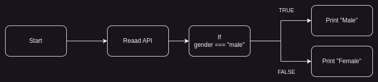
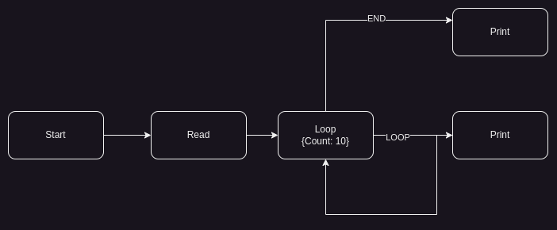
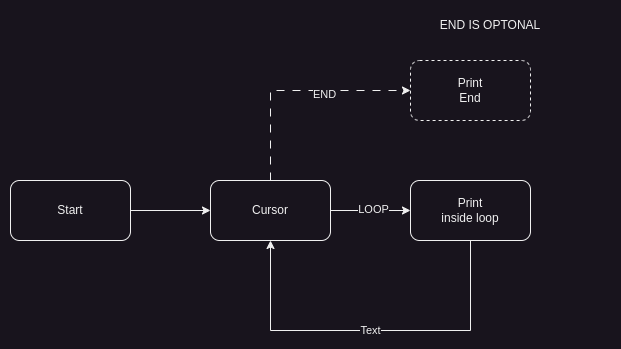
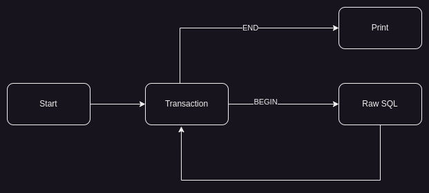
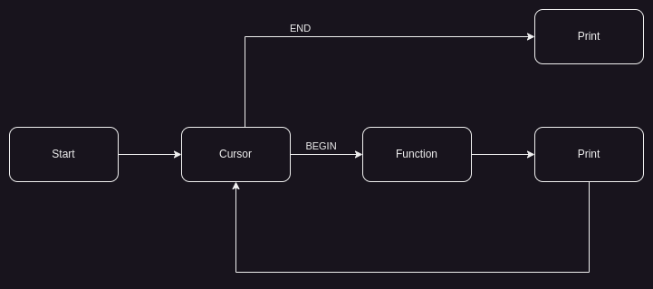

# Flow Engine

A simple flow engine implementation in NodeJs. For explanation please refer to this post https://harin76.medium.com/write-your-own-flow-engine-f7cda72074f3.

# Built in nodes
Following nodes are built in to the engine.
* Cursor
* Function
* If 
* Loop
* Raw SQL
* Start
* Transaction

# Examples
Refer to the example flows in `__tests__/test_*.js` files.

# How to run tests
```shell
node __tests__/test_<test-name>.js
```
# Quick description about the tests

## test_flow.js - Demonstrates the basic branching flow using the if task


## test_loop.js - Demonstrates the basic looping


## test_cursor.js - Demonstrates the cursor node


## test_raw_sql.js - Demonstrates the raw sql node


## test_transaction.js - Demonstrates the transaction node


## test_function.js - Demonstrates the function node
